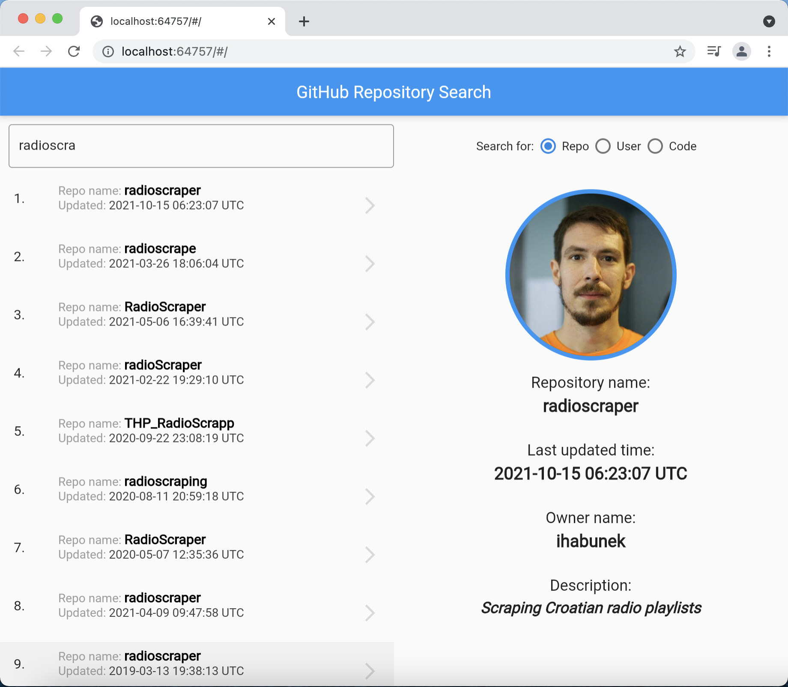
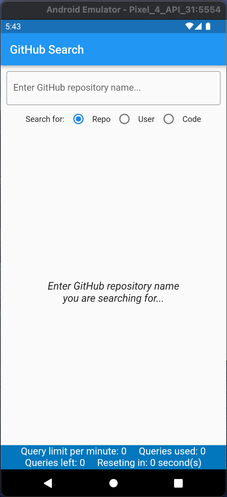
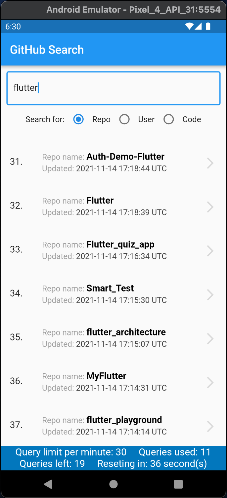
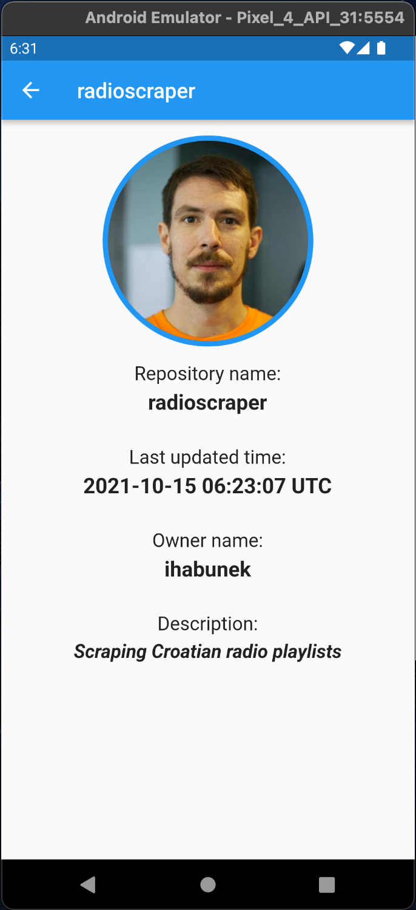
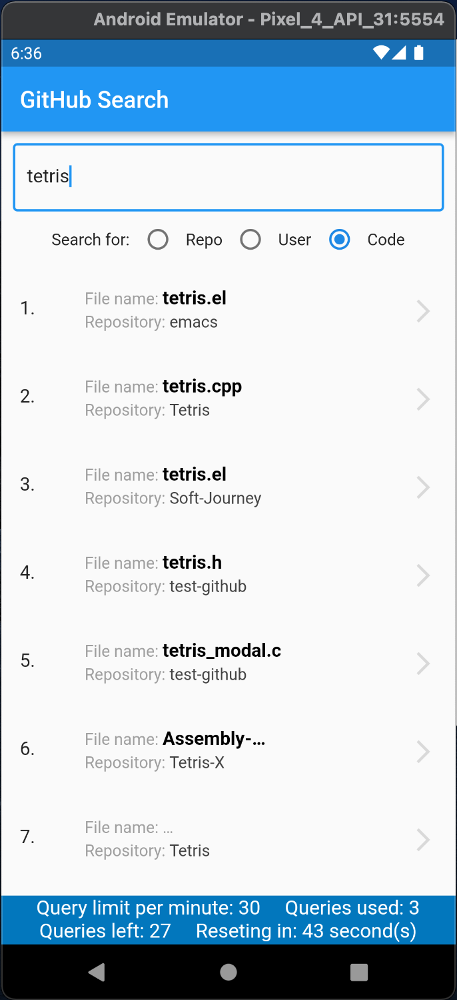

# GitHub Search

A GitHub Search showreel app done in Flutter

## Brief details

App searches for GitHub repositories, users and code using GitHub API. 

App displays results in a list.

Repositories are displayed in descending order of last updated time. 
Users are sorted by number of public repositories in descending order. 
Code is sorted by best match.

When details for a searched GitHub User are displayed, a new query 
is done towards GitHub API to fetch Users real name since this 
information is not received with rest of User data.

By clicking a list item it opens a details page with owners profile picture 
and corresponding details for particular type of search.

Upon every search a query is done to fetch search limit quota  
with number of queries used and left and the time until the quota will
be reset. Search limit quota is 30 queries a minute for authenticated
requests and 10 queries a minute for unauthenticated requests. This data
is displayed below search results list.

App is optimized for different screen sizes and responsive design 
is implemented.

App is tested on Android and Chrome.

## Screen recording and screenshots

